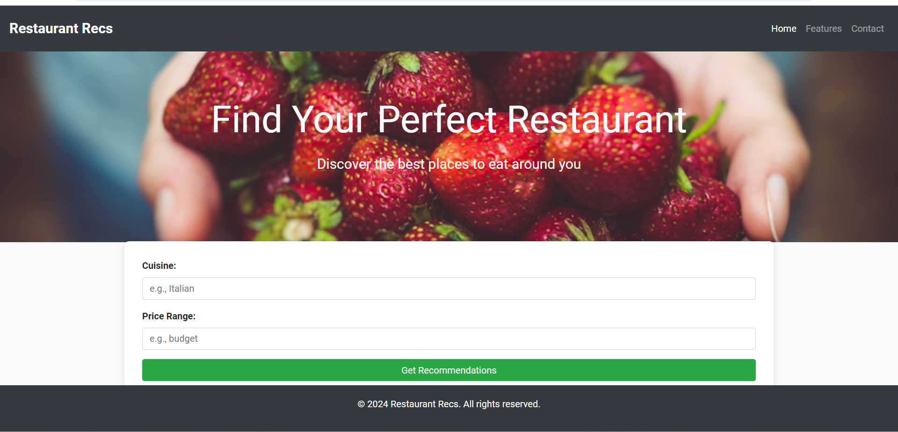
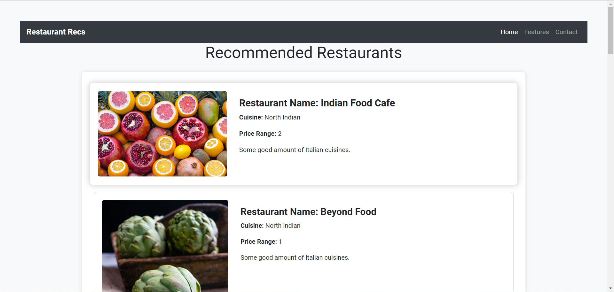

# Restaurant Recommendation System

This project implements a Restaurant Recommendation System using Flask for the backend and a Machine Learning model for prediction.

## Overview

The Restaurant Recommendation System recommends restaurants based on user inputs such as cuisine preference and price range. It utilizes a Flask server to handle backend operations and communicate with a trained Machine Learning model. The model predicts suitable restaurants based on the input criteria, providing users with personalized recommendations.

## Unsplash Images:

the unsplash image api is used for constant and dynamic image generation you can create it and use it for free in your project

---> navigate to this link [Unsplash Image](https://unsplash.com/developers)


## Web Page (Images & video Links):

## Video Link:

https://github.com/Blacksujit/Restaurant_Recommendation_using_ML/assets/148805811/be14242e-f12c-4e89-bb7b-6387991a65ab


## Images :

### 1.) Home Page:




### 2.) Recommendations Page:




## Folder Structure:

```

restaurant_recommendation_system/
│
├── app/
│   ├── static/
│   │   ├── css/
│   │   │   ├── indexpage.css
│   │   │   ├── recommendation.css
│   │   │   └── style.css
│   │   └── js/
│   │       └── script.js
│   ├── templates/
│       ├── index.html
│       └── recommendations.html
│   
│
├── data/
│   └── Dataset.csv
│
├── model/
│   ├── recommendation_model.pkl
│   ├── restaurants_df.pkl
│   ├── tfidf_vectorizer.pkl
│   ├── trainmodel.py
│   └── trinmodel.ipynb
│
├── README.md
|── requirements.txt
|── ML_model.ipynb   
├── run.py


```

## Dataset Information

The predictive model was trained on the [Restaurant Rating Dataset](https://www.kaggle.com/datasets/uciml/restaurant-data-with-consumer-ratings) from Kaggle. This dataset contains various features of restaurants, such as average cost for two, price range, and votes, alongside their respective ratings. The dataset was preprocessed to handle missing values, categorical features, and normalization for better model performance.

## Features

- **Backend**: Built with Flask, handling HTTP requests and integrating with the ML model.
- **Machine Learning Model**: Trained to predict restaurant recommendations based on cuisine and price range.
- **Dynamic Frontend**: Allows users to input their preferences and receive real-time recommendations.
- **Integration**: Seamless integration of Flask backend with a dynamic  frontend for a responsive user interface.

## Setup

Follow these steps to set up the Restaurant Recommendation System locally:

### Prerequisites

- Python (3.6 or higher)
- Flask
- Scikit-learn (for ML model)
- React.js (for frontend, if applicable)

### Installation

1. Clone the repository:

   ```bash
   git clone https://github.com/Blacksujit/Restaurant_Recommendation_using_ML.git
   ```

   ```bash
   cd restaurant_recommendation_system
   ```

2. Install dependencies:

   ```bash
   pip install -r requirements.txt
   ```

3. Run Flask application:

   ```bash
   python run.py
   ```

4. Access the application in a web browser at `http://localhost:5000`.


## License:


This project is licensed under the MIT License .
